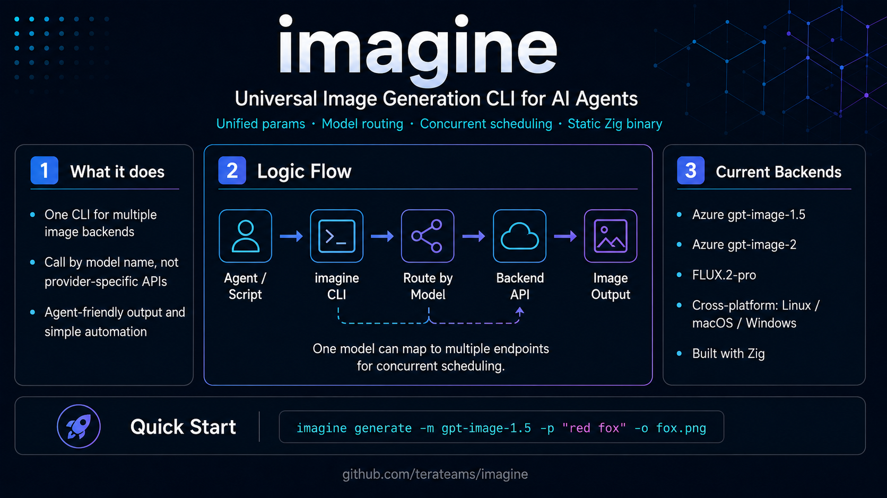

# imagine

[](https://github.com/terateams/imagine/actions/workflows/ci.yml)
[](https://github.com/terateams/imagine/actions/workflows/release.yml)

---



---

A universal **image-generation CLI for AI agents**. Unified front-end
parameters, routed to different backends by model name. One model can have
multiple endpoints (URL + key) for concurrent scheduling. Single static Zig
binary — no `curl`/`jq`/`base64` dependencies.

- **Unified params** → route to a backend by `-m <model>`.
- **Multi-backend, extensible** — add a model by adding one body-builder + one switch arm.
- **Concurrent scheduling** — multiple endpoints per model are load-balanced.
- **Agent-friendly** — `--json` machine output, `--dry-run`, meaningful exit codes.

First backends: Azure `gpt-image-1.5`, `gpt-image-2` (image generations) and
`FLUX.2-pro` (Black Forest Labs).


## Install

One-liner for Linux / macOS (auto-detects OS/arch, downloads the prebuilt
binary and agent skill from the GitHub release, and verifies their SHA-256 —
no compilation):

```bash
curl -fsSL https://raw.githubusercontent.com/terateams/imagine/main/install.sh | sh
```

This installs the `imagine` binary to `~/.local/bin` and the agent skill to
`~/.agents/skills/imagine`. Override with `IMAGINE_BIN_DIR`, `IMAGINE_AGENTS_DIR`,
or pin a release with `IMAGINE_VERSION=v0.1.0`.

**Windows:** download `imagine-windows-x86_64.exe` (or `-aarch64`) from the
[latest release](https://github.com/terateams/imagine/releases/latest) and put
it on your `PATH`.

Prebuilt binaries are published for every tagged release across Linux, macOS,
and Windows on both `x86_64` and `arm64`.

From a source checkout (or any platform without a prebuilt binary):

```bash
make install        # build + install binary and skill
# or just the binary:
make build && cp zig-out/bin/imagine ~/.local/bin/
```

Building from source requires **Zig ≥ 0.16.0** (`brew install zig` or
<https://ziglang.org/download/>).

## Quick start

```bash
imagine config init                 # write ~/.imagine/config.json (3 Azure models)
export AZURE_API_KEY="your-key"     # or edit the config file
imagine models                      # check which models are ready

imagine generate -m gpt-image-1.5 -p "A photograph of a red fox in an autumn forest" -o fox.png
imagine generate -m FLUX.2-pro    -p "a city at dusk" --width 1024 --height 1024 -o city.png
imagine generate -m gpt-image-2   -p "logo concept"   -n 4 -o logo.png -c 4
```

## Commands

```
imagine generate -m <model> -p <prompt> [options]
imagine batch <manifest.json> [-c N] [--json]
imagine models [--json]
imagine config path | init [--force] | show
imagine version | help
```

### generate options

| Option | Description |
|--------|-------------|
| `-m, --model <name>` | Model to route to (**required**) |
| `-p, --prompt <text>` | Prompt (**required**; or positional) |
| `-o, --output <path>` | Output file (single) or stem (multiple) |
| `-n, --n <count>` | Number of images (default 1) |
| `-s, --size <WxH>` | Size for gpt-image models (see [Model sizes](#model-sizes)) |
| `--width / --height <px>` | Dimensions for FLUX models (use instead of `--size`) |
| `--format <fmt>` | `png` / `jpeg` (gpt-image `output_format`) |
| `--compression <0-100>` | Output compression (gpt-image) |
| `--quality <q>` | `low` / `medium` / `high` / `auto` (gpt-image) |
| `--seed <int>` | Seed (where supported) |
| `-c, --concurrency <n>` | Parallel requests (default: endpoint count) |
| `--config <path>` | Use a specific config file |
| `--json` | Emit a JSON result object |
| `--dry-run` | Print request body without calling the API |
| `-q, --quiet` | Suppress progress |

Exit codes: `0` success · `1` run failure (incl. partial) · `2` usage error.

### Model sizes

Verified against the live Azure endpoints:

| Model | Size constraints |
|-------|------------------|
| `gpt-image-1.5` | `--size` ∈ `1024x1024`, `1536x1024` (landscape), `1024x1536` (portrait), `auto` |
| `gpt-image-2` | `--size` = any `WxH` with both sides a multiple of **16**, longest edge ≤ **3840** (plus a minimum pixel budget) |
| `FLUX.2-pro` | `--width`/`--height` each ≥ **64**, with `width × height ≤ 4 MP` (≤ `2048x2048`); no divisibility requirement |

Unsupported sizes return a clear API error (e.g. `Supported sizes are 1024x1024, 1024x1536, 1536x1024, and auto.`).

### batch manifest

```json
{
  "jobs": [
    { "model": "gpt-image-1.5", "prompt": "a fox",  "output": "out/fox.png" },
    { "model": "FLUX.2-pro",    "prompt": "a city", "output": "out/city.png", "width": 1024, "height": 1024, "n": 2 },
    { "model": "gpt-image-2",   "prompt": "a tree", "output": "out/tree.png", "size": "512x512" }
  ]
}
```

Per-job keys: `model, prompt, output, size, width, height, n, format, compression, quality, seed`.

## Configuration

Path resolution: `--config` > `$IMAGINE_CONFIG` > `~/.imagine/config.json`.

A ready-to-edit sample lives at [`config.example.json`](config.example.json)
(it shows a model with **two endpoints** for concurrent scheduling). Copy it,
or run `imagine config init` to write the built-in starter:

```bash
cp config.example.json ~/.imagine/config.json   # then edit URLs/keys
```

```jsonc
{
  "output_dir": "~/.imagine/outputs",
  "concurrency": 0,                       // 0 = auto (endpoint count)
  "models": {
    "gpt-image-1.5": {
      "backend": "azure_image",           // azure_image | azure_flux
      "api_model": "gpt-image-1.5",
      "endpoints": [                       // multiple → concurrent scheduling
        {
          "base_url": "https://<resource>.services.ai.azure.com/openai/v1/images/generations",
          "api_key_env": "AZURE_API_KEY",  // or "api_key": "literal"
          "auth": "bearer"                  // bearer | api-key
        }
      ],
      "defaults": { "size": "1024x1024", "output_format": "png", "output_compression": 100, "quality": "high" }
    }
  }
}
```

Precedence — params: CLI > model `defaults` > built-in. Keys: endpoint
`api_key` > `api_key_env`.

### `--json` result

```json
{ "ok": true, "model": "gpt-image-1.5", "backend": "azure_image",
  "requested": 1, "succeeded": 1, "failed": 0,
  "images": [ { "path": "fox.png", "bytes": 12345 } ], "errors": [] }
```

## Development

```bash
make build      # zig build -Doptimize=ReleaseFast
make test       # zig build test
make run ARGS="generate -m gpt-image-1.5 -p 'a fox' --dry-run"
make fmt        # zig fmt
make help       # list targets
```

Architecture, module boundaries, the "add a backend" recipe, and the roadmap
live in [AGENT.md](AGENT.md). The agent skill lives in
[`skills/imagine`](skills/imagine/SKILL.md).

## License

See [LICENSE](LICENSE).
